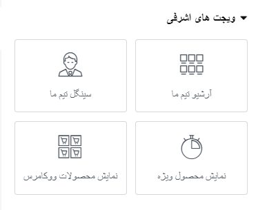

# ew-products-widgets

## Description

**ew-products-widgets** is an Elementor addon that introduces custom widgets for displaying WooCommerce product archives. It enhances your WordPress site with additional functionality and styling options specifically for WooCommerce products.

## Features

- Custom widgets for Elementor
- Designed for WooCommerce product archives
- Easy to use and integrate

## Requirements

- WordPress 5.0 or higher
- Elementor 3.23 or higher
- PHP 8.1 or higher

## Installation

1. Upload the `ew-products-widgets` folder to the `/wp-content/plugins/` directory.
2. Activate the plugin through the 'Plugins' menu in WordPress.
3. Ensure that Elementor is installed and activated.
4. Start using the new widgets in the Elementor editor.

## Frequently Asked Questions

### Does this plugin require Elementor?
Yes, this plugin requires the Elementor page builder to be installed and activated.

### Where can I find the custom widgets after activation?
After activating the plugin, the custom widgets will appear in the Elementor editor under the 'custom-widget-category' (ویجت های اشرفی) category.

### How can I contribute to this plugin?
You can contribute to the development of this plugin by submitting pull requests to our [GitHub repository](https://github.com/mohamad-ashrafi/product-widget-elementor).

## Screenshots

1. **main page**
   
2. **Settings page**
   

## Changelog

### 1.0.0
- Initial release.

## Upgrade Notice

### 1.0.0
- Initial release. Ensure that Elementor is installed and activated before using this plugin.

## Notes
************

## License

This plugin is licensed under the GPLv2 or later. See the [GNU General Public License](https://www.gnu.org/licenses/gpl-2.0.html) for more details.
